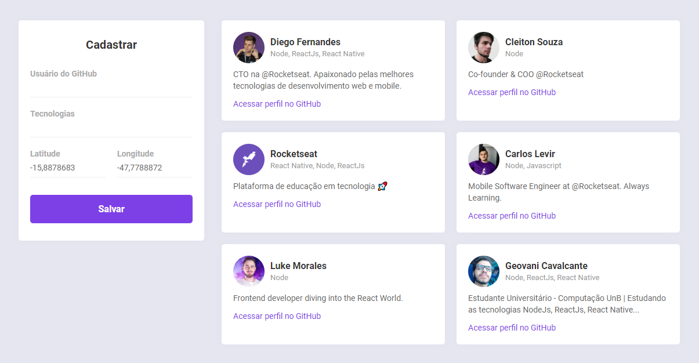
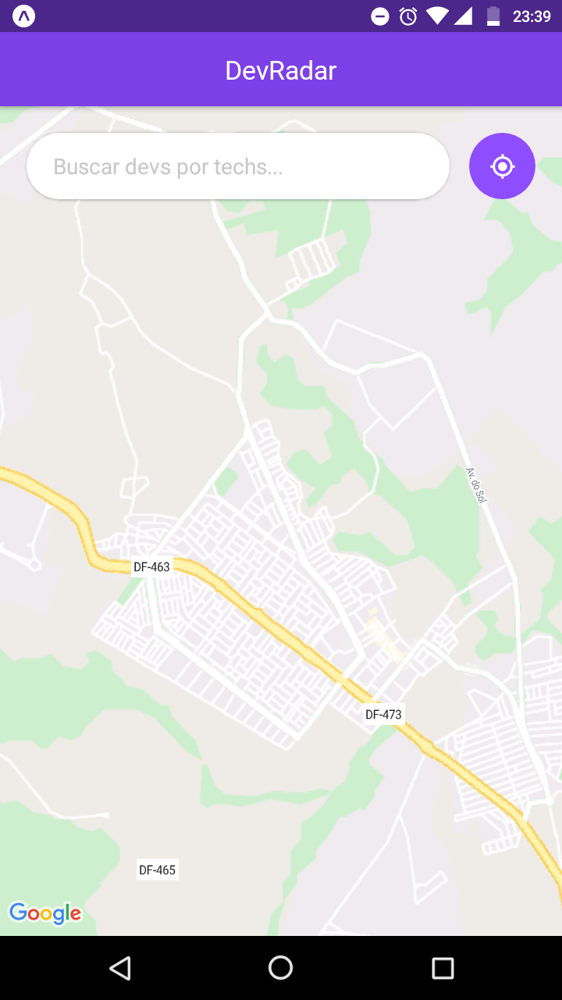
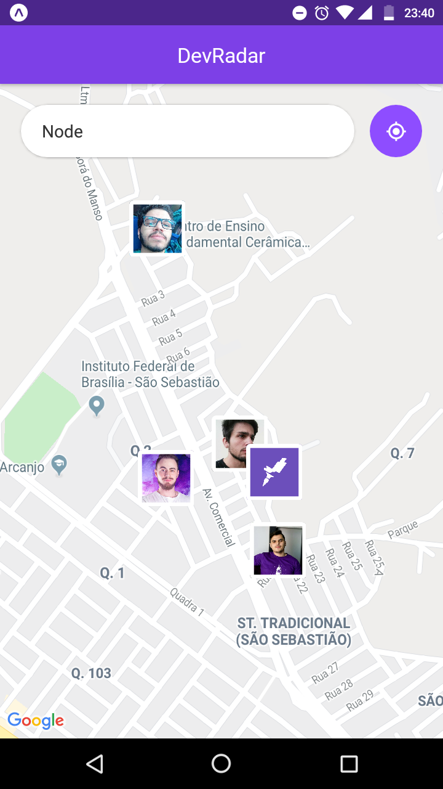
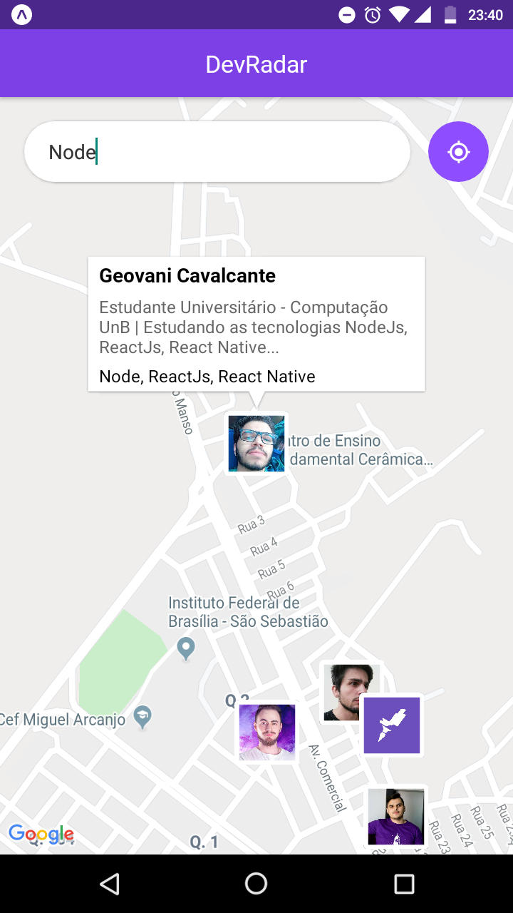
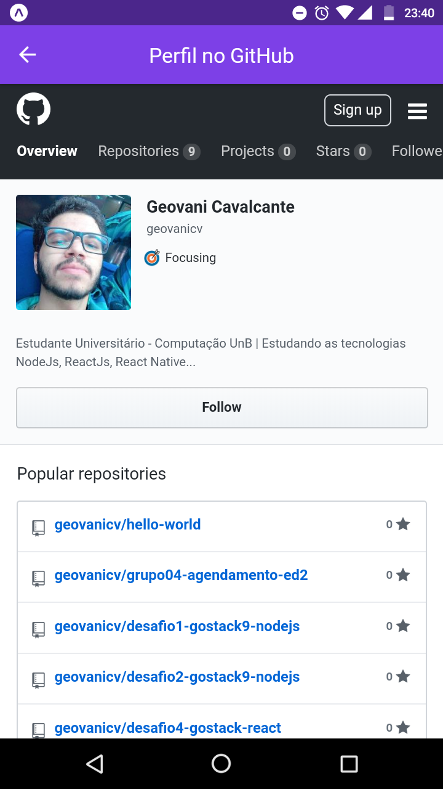

<h3>
  DevRadar - Semana OmniStack 10
</h3>

DevRadar é uma aplicação completa desenvolvida com NodeJs no backend, ReactJs no frontend Web e React Native no frontend Mobile. 
Essa aplicação tem como proposta encontrar desenvolvedores num raio de 10km do usuário, sendo possível essa busca através de filtro por tecnologias!

O frontend web fica com a responsabilidade de criar uma interface de cadastro dos devs, cabendo ao backend processar essas requisições:
<h1 align="center">
    
</h1>

O fronend mobile mostra em tempo real esses devs cadastrados em suas respectivas localizações:
<h1 align="center">
    
    
    
    
</h1>

## :rocket: Tecnologias

Esse projeto foi desenvolvido na semana omnistack 10 da Rocketseat com as seguintes tecnologias:

-  NodeJS no backend
-  Express
-  Mongoose
-  MongoDB
-  Nodemon
-  Socket.io
-  Axios
-  Cors
-  Geolocalização
-  ReactJS no frontend Web
-  CSS
-  React Native no frontend Mobile
-  Socket.io-client
-  Expo
-  Expo-location
-  React-native-maps
-  WebView
-  VS Code

## :information_source: Como executar este projeto

```bash
# Clone este repositório
$ git clone https://github.com/geovanicv/devRadar-omnistack10
```

Executando a API:

```bash
# Navegue até a pasta
$ cd devRadar-omnistack10/backend

# Instale as dependências
$ yarn install

# Execute o backend
$ yarn dev
```

Executando o frontend WEB:

```bash
# Navegue até a pasta
$ cd devRadar-omnistack10/frontend

# Instale as dependências
$ yarn install

# Execute o backend
$ yarn start
```

Executando o frontend Mobile:

```bash
# obs: é necessário um emulador aberto ou o expo instalado no seu celular!

# Navegue até a pasta
$ cd devRadar-omnistack10/mobile

# Instale as dependências
$ yarn install

# Execute o backend
$ yarn start

# Leia o qrcode gerado no aplicativo do expo no seu celular
```


